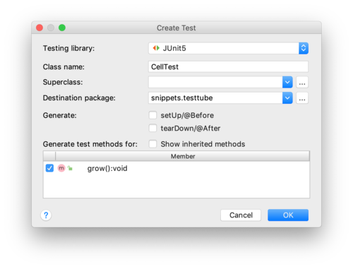

# A first look at objects: growing cells

## The entities

Suppose you want to build a cell growth simulation application. After careful analysis of
the domain, I decided that this involves three entities I want to model: a simulator that
controls the simulation process, a test tube that will hold the cells that are growing, and 
cells.

## The relationships

The next step in a modeling process is to determine the relationships between the different 
entities. In this case, this is quite simple. The simulator will receive configuration arguments 
(e.g. how many cells to grow) from the command-line, start the simulation process and 
instantiate a test tube. The test tube will be responsible for instantiating the (initial) cell
population. Finally, there will be cells growing "within" the test tube.

## The code

Three separate source files are created (within a single package), each holding one class - a 
blueprint for the entities to be instantiated:

- `CellGrowthSimulator.java`
- `TestTube.java`
- `Cell.java`

#### Cell.java

We'll start with the simplest one: Cell. It has an instance variable called "size" which has a default 
value of 5 when Cell objects are instantiated. Every call of the `grow()` method makes it increase its size by one.

```java
package snippets.testtube;

public class Cell {
    /**
     * Instance variable "size"; 5 micrometer is the default diameter when Cell objects are instantiated
     */
    int diameter = 5;
    /**
     * Lets this cell grow in a single increment
     */
    public void grow() {
        //grow by 1 micrometer
        this.diameter += 1;
        System.out.println("I am a Cell. My size is " + this.diameter);
    }
}
```

To test the logic and correctness of this class, we will have to wait until other components are 
developed, such as TestTube and CellGrowthSimulator, **_unless you use (J)Unit testing_**. 

#### JUnit testing

JUnit is a unit test platform for Java. Its main purpose is to have a suite of test code guaranteeing 
the correctness of your **_production code_**. To create JUnit test code, you need to have the 
JUnit libraries defined as dependencies on your **_class path_**. 
See the post ["A first IntelliJ project"](/01_getting_started/intellij.md) for instructions how to 
that for JUnit5.

Next, you need to create a test class. Place the cursor on the class name and press `alt+enter`. Select "Create Test".

 

Select the method(s) you want to create test(s) for.



The test class opens in the editor and looks something like this:

```java
package snippets.testtube;

import org.junit.jupiter.api.Test;
import static org.junit.jupiter.api.Assertions.*;

class CellTest {

    @Test
    void grow() {
    }
}
```

Let's put some testing code in it to see whether our program logic works as intended:

```java
    @Test
    void grow() {
        Cell cell = new Cell();
        //the initial diameter is supposed to be 5
        assertTrue(cell.diameter == 5);
        cell.grow();
        //the diameter should have increased by one
        assertTrue(cell.diameter == 6);
    }
```

When you click on the little green triangle in the editor margin, the test will be executed and you get output like this:


The green checks indicate the test **_assertions_** passed. Knowing the Cell class is OK, let's proceed to class TestTube.


#### TestTube.java

TestTube is slightly more complex. It defines a **_constructor_** that makes it mandatory to
provide an initial number of cells. Also, you see the use of the `new` keyword for instantiating objects.

```java
package snippets.testtube;

public class TestTube {
    Cell[] cells;

    /**
     * Constructs with an initial cell count.
     * An exception is thrown when the initial cell count is below 1 or above 10e4.
     *
     * @param initialCellCount the initial cell count
     * @throws IllegalArgumentException ex
     */
    public TestTube(int initialCellCount) {
        if (initialCellCount == 0 || initialCellCount > 10e4) {
            throw new IllegalArgumentException("initial cell count should be above 1 and below 10e4: " + initialCellCount);
        }
        //initialize the array with new Cells
        cells = new Cell[initialCellCount];
        for (int i = 0; i < initialCellCount; i++) {
            cells[i] = new Cell();
        }
    }

    /**
     * Grows the cells, in one single iteration.
     */
    public void growCells() {
        for (Cell cell : cells) {
            cell.grow();
        }
    }
}
```

Note the for-loop in the constructor of this class:

```java
for (int i = 0; i < initialCellCount; i++) {
    cells[i] = new Cell();
}
```

The for-loop itself will be dealt with in the post ["Flow control structures"](/02_syntax/flow_control_structures.md) This is the first place we see the `new` keyword. Whenever you see the `new` keyword, it means a new object is instantiated. See the section below for more detail on object construction. 

Here is a simple JUnit test to verify the construction of the TestTube:

```java
class TestTubeTest {
    @Test
    void growCells() {
        TestTube testTube = new TestTube(10);
        assertTrue(testTube.cells.length == 10);
    }
}
```

#### CellGrowthSimulator.java

The last class of the system. Here is the first version:

```java
package snippets.testtube;
/**
 * "Controller" class
 */
public class CellGrowthSimulator {
    /**
     * @param args cl-args should be length one, containing initial cell number.
     */
    public static void main(String[] args) {
        if (args.length != 1) {
            System.err.println("You must provide an initial cell count. Aborting.");
        }

        int initialCellNumber = Integer.parseInt(args[0]);
        startSimulation(initialCellNumber);
    }

    private static void startSimulation(int initialCellNumber) {
        TestTube testTube = new TestTube(initialCellNumber);
        //do one iteration of growing
        testTube.growCells();
    }
}
```

Note that directly processing command-line arguments is discouraged in general; you should implement
and support a standards-adhering command-line syntax (e.g. `java -jar GrowthSimulator --initial_count 5`).

So the final model now has this chain of relationships:

**_CellGrowthSimulator has a TestTube and TestTube has one or more Cells_**.


## Object construction (first iteration)

You have seen the `new` keyword used several times now. But what does happen, exactly, when you type

```java
Cell cell = new Cell();
```

The new keyword combined with the class name followed by parentheses, calls the constructor method of a class that instantiates and returns the reference to an object of that class. The parentheses `()` enclose the argument list for the constructor method, which is empty in this case.  

The **_three steps of object construction are declaration, creation and assignment_**:

1. `Cell cell` **_declares_** a variable of type Cell.
2. `new Cell` **_instantiates_** an object of type Cell, stores this in memory (called **_the heap_** in Java) and returns a reference to this stored object.
3. `=` **_assigns_** the returned reference to the declared variable.

So…where is this constructor method in class Cell and what does it do? It is created automagically by the 
Java compiler, if you don't specify it yourself. More on constructors in a later post.

