# A first IntelliJ project

This course uses the IntelliJ Idea Integrated Development Environment (IDE) to 
develop Java programs. This chapter deals with using IntelliJ Idea to create 
Java applications.

## Dependency management
As you probably already know by now, code you write is 
dependent on other code. This can be code native to the platform (such as the 
`integer` "class" in R, or the `str` class in Python), but it can also be code 
that is not distributed with the standard platform (such as `ggplot2` in R).
These "non-core" code dependencies need to be managed, especially with a compiled 
language such as Java. Several tools exist for dependency management in Java. In
 this course we'll use **_Gradle_**. It does much more than dependency management, but for 
 now this is the relevant aspect.

## A first project
Start IntelliJ and select "`+ Create New Project`" from the start screen. 

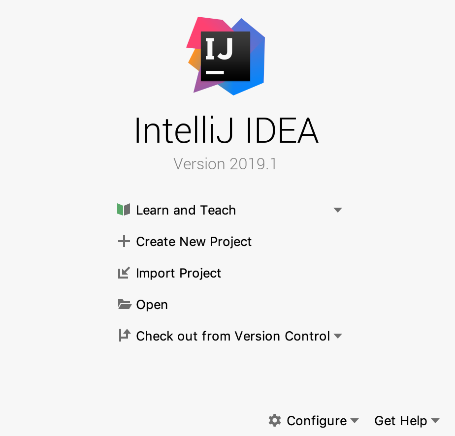

In the New Project wizard, select Gradle on the left menu and then a project SDK (Standard Development Kit) - the examples 
shows Java 10. Only check Java in the Libraries section.

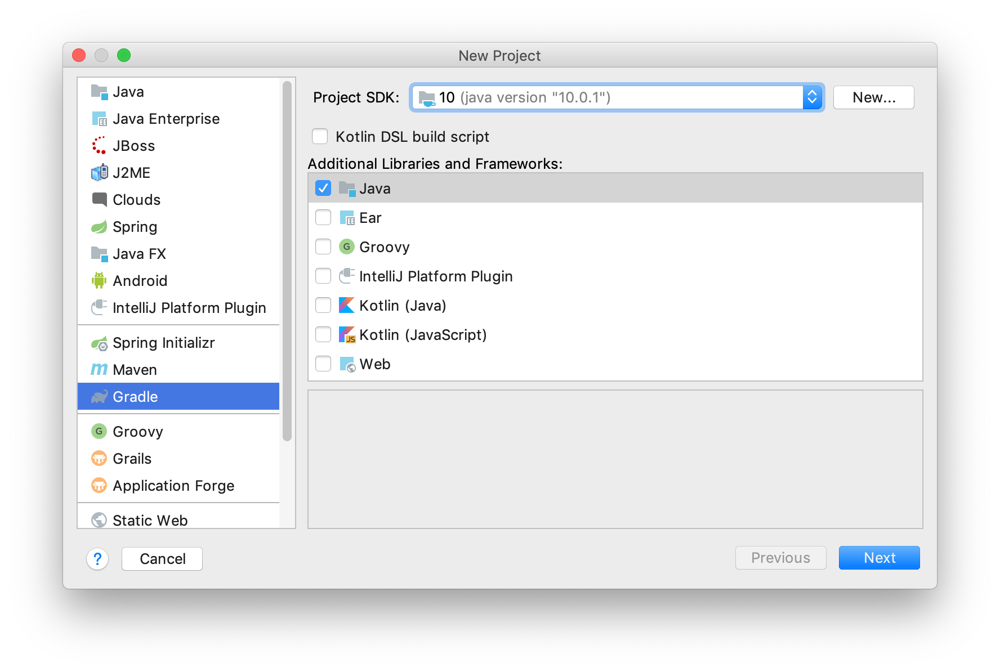

Click "Next". In the next window, give your project a **_GroupID_**, an **_ArtifactID_** and a **_Version_**. 

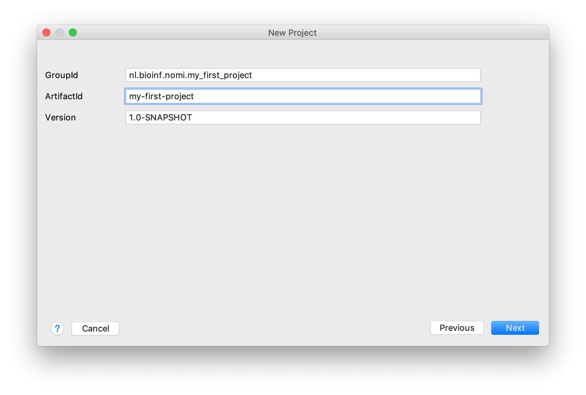

The group ID should be a unique identifier; in Java this is usually the web domain of you or your employer, reversed and with a project name appended (note the underscores). The artifact ID is the name of your project. The version speaks for itself.

Click "Next".

The last window lets you specify some Gradle-specific stuff. Fill out as shown below.

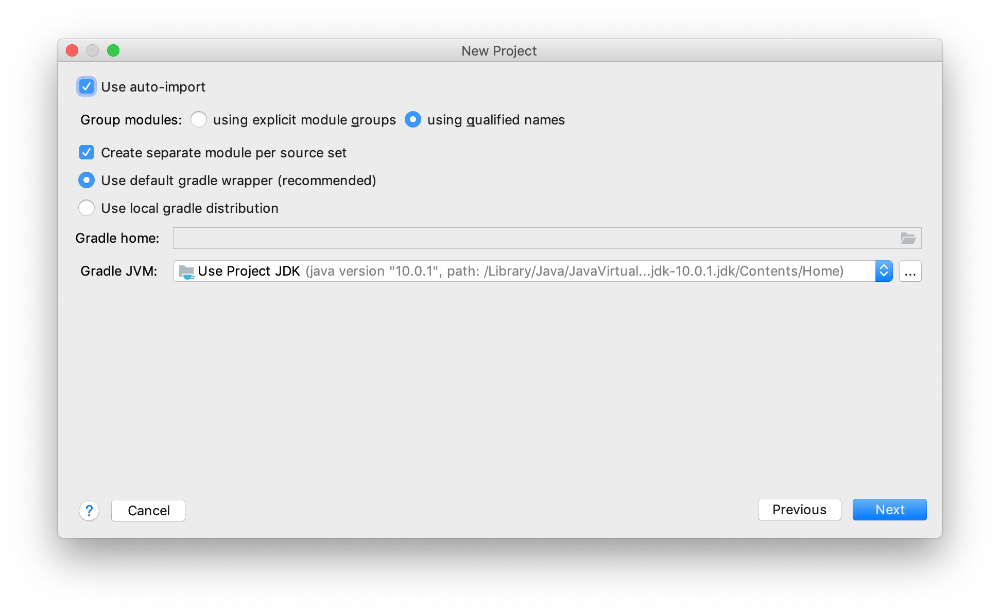

Click "Next". 

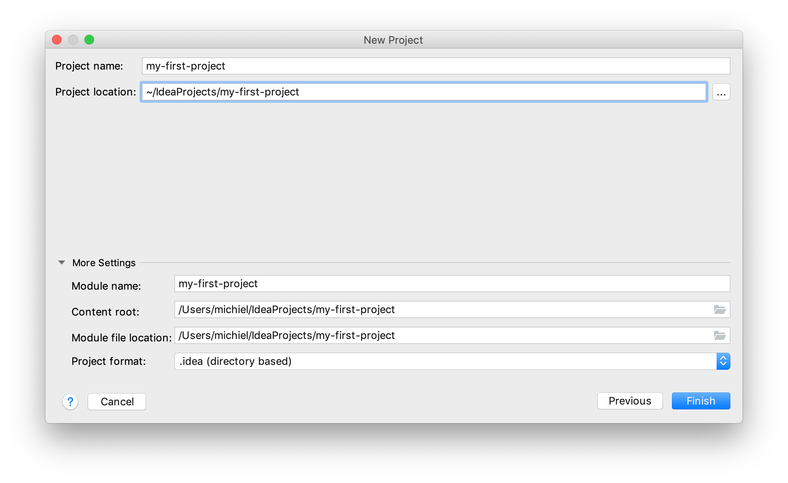


Click "Finish". A fresh Gradle-managed Java project will be created with a layout as shown below.

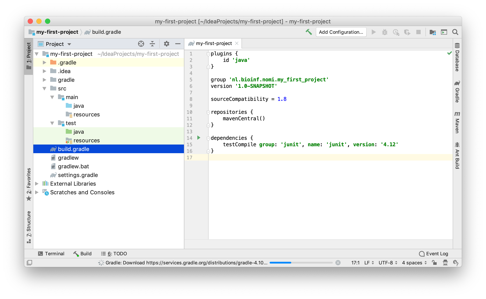

Several folders and files have been created. At the root of the project there is a `build.gradle` file. It contains the configuration of your project. One dependency has been added: JUnit 4 which is a testing framework. Since this is an older version, we'll immediately change this into JUnit5. Replace as shown below:

```gradle
dependencies {
    //don't use JUnit 4
    //testCompile group: 'junit', name: 'junit', version: '4.12'
    //JUnit 5 is better
    testImplementation 'org.junit.jupiter:junit-jupiter-api:5.1.0'
    testRuntimeOnly 'org.junit.jupiter:junit-jupiter-engine:5.1.0'
}
```
Maybe IntelliJ suggests something about auto-import; accept this.

Finally, let's create some code. Right-click on the `src/main/java` folder and select "New" -> "Package" and give it the same name as your group ID (it is also in `build.gradle`).

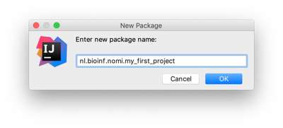

Select the new `package`, right-click it and select "New" -> "Java Class". Name it `HelloWorld` (do not give any file extension!) and click "OK".

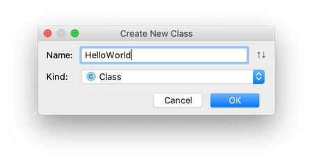
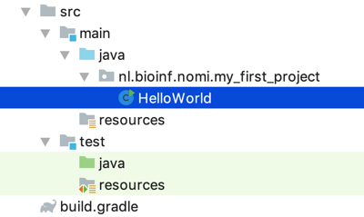


The class file will open in an editor. Here is a taste of the IntelliJ magic. Within the class, put the caret below the line `public class HelloWorld`. Next, type "psvm" and press tab.

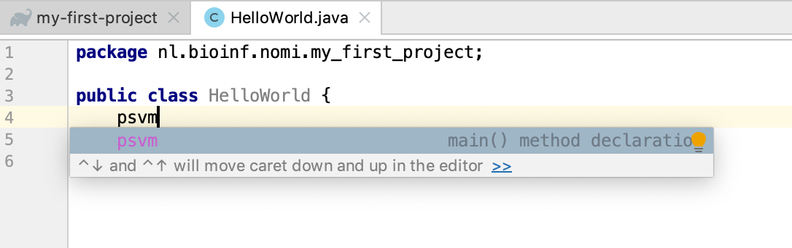

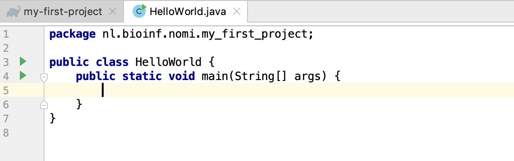

A brand new `main()` method is created. Here is another extremely useful shortcut, assuming the caret is within `main()`. Type "sout" followed by the tab. 

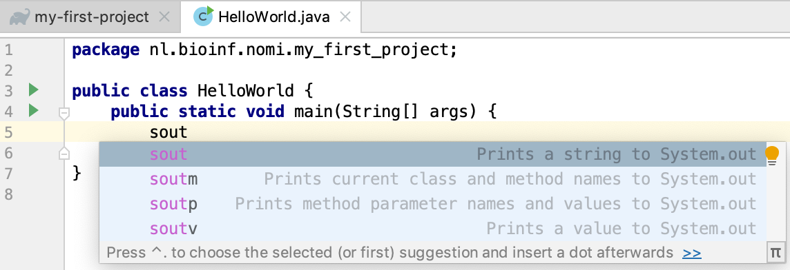

The statement `System.out.println();` appears. Within this print call, type "Hello, World". Your class should look like this, except that your package will be named differently:

```java
package nl.bioinf.nomi.my_first_project;

public class HelloWorld {
    public static void main(String[] args) {
        System.out.println("Hello, World");
    }
}
```

Click the green triangle within the editor border and select "run 'HelloWorld.main()' Note the shortcut for running main: `^ + shift + R`.

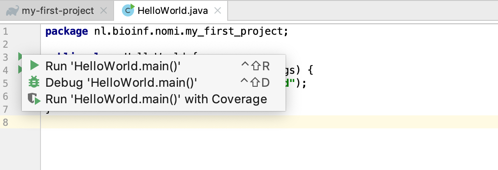

In the console output on the lower pane, you will see this output, including the "Hello, World" message:

<pre class="console_out">
20:38:51: Executing task 'HelloWorld.main()'...

> Task :compileJava
> Task :processResources NO-SOURCE
> Task :classes

> Task :HelloWorld.main()
Hello, World

BUILD SUCCESSFUL in 0s
2 actionable tasks: 2 executed
20:38:52: Task execution finished 'HelloWorld.main()'.
</pre>

The "Tasks" are gradle stuff. It says, amongst others, that the source is compiled (Java is a compiled language!) and main() is run. You may notice that a new folder has appeared at the root of your project: `build`. Have a look at what's inside.

That's it. This is how you create a Gradle-managed Java project, put a package in it, a first class at the correct location and within that, a main() method.

These are the keyboard shortcuts you should remember:

- **`psvm`** - create main()
- **`sout`** - create print statement
- **`^ + shift + R`** - run main()

Next up: some really basic Java stuff to get a feel for the language.

