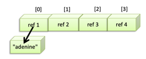

# Arrays

Just like any programming language, Java knows about arrays.
Arrays are ordered collections of variables of the same type. 
These elements can by any valid Java type: primitives, 
object references, or even null values.

These variables are not individually named and managed, but collectively.

In real life, you don’t use arrays too much because other types (ArrayList) 
are often more convenient because arrays can't be extended or shortened and 
don't have all those nice helper methods that ArrayList has 
(see the [collections post](collections_io/collections.md)). However, arrays 
certainly have their use when (memory) efficiency is an issue, or when you want 
to go multidimensional.

Of course, the String array `String[] args` is the entry point of outside arguments into any 
Java program:

```java
public static void main(String[] args) {
    for(int i = 0; i < args.length; i++) {
        System.out.println("argument " + i + " is " + args[i]);
    }
}
```


## Creating arrays

To create an array, you have to specify what type it will hold, and how many elements
it will hold. This can be done via:

1. passing the size as a "constructor" argument
2. declaring a literal

Here are both ways for primitives and reference type elements.

```java
//create by specifying size - will contain zeros
int[] numbers = new int[5];
//create by specifying contents
double[] scores = {2.1, 3.0, 4.5, 5.6};
//create by specifying size - will contain nulls
Cell[] cells1 = new Cell[6];
//create by specifying contents
Cell[] cells2 = {new Cell(), new Cell(), new Cell()};
```

Note that when only the size is specified, the array will be filled with the type's **_default value_**, 
which is:

- `false` for `boolean`
- `u0000` for `char`
- 0 or 0.0 for numeric types (`byte`, `short`, `int`, `long`)
- `null` for reference types

An array of primitives will actually contain the primitive values.


An array of objects will hold the references to the objects, not the objects themselves



## Printing

If you want to print an entire array, use the method `Arrays.toString()`:

```java
System.out.println("bytes = " + Arrays.toString(bytes));
```

## Accessing

To get to an element of an array, you use an index. Java array indexing starts at zero.


```java
int[] numbers = new int[7];
numbers[0] = 42;
numbers[4] = 22;
```


Arrays are often created and accessed using a for loop:

```java
Cell[] cells = new Cell[number];
for(int i = 0; i < number; i++) {
	cells[i] = new Cell();
}
```

Or, if you like, the new post-Java-8 way:

```java
int size = 10;
Cell[] cells = new Cell[size];
IntStream.range(0, size)
    .forEach(n -> cells[n] = new Cell());
System.out.println("cells = " + Arrays.toString(cells));
```

## Multidimensional arrays

Multidimensional arrays have their use. Usually with numeric settings. You can up the number of dimensions way into the hypothetical realm. Here is an example of a two-dimensional one:

```java
final int sideLength = 5;
//creates 5*5 array
int[][] scoreBoard = new int[sideLength][sideLength];
for (int i = 0; i < sideLength ; i++) {
    for (int j = 0; j < sideLength; j++) {
        scoreBoard[i][j] = i*j;
    }
}

for (int i = 0; i < sideLength ; i++) {
    System.out.println(Arrays.toString(scoreBoard[i]));
}
```

will output:

```
[0, 0, 0, 0, 0]
[0, 1, 2, 3, 4]
[0, 2, 4, 6, 8]
[0, 3, 6, 9, 12]
[0, 4, 8, 12, 16]
```

