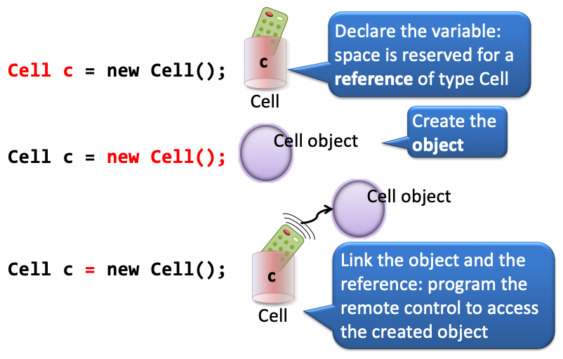

# Data Types

Data forms the **_state_** of an object. They define the properties that define how it will **_behave_** through methods.
As stated before, Java is a **_strongly typed_** language. That means every variable, method parameter and method return type needs to have a declared type. These types can be **_primitives_** or **_reference types_**. This post deals with both, and with the "behavioral" differences between them.

## Primitives

In essence, every programming language knows about the same data types: integers, floats, booleans, Strings. Java is no different. However, there are a few major distinctions. First, you need to declare the type of every variable. Also, conversion between them usually needs to be done explicitly. Finally, for memory efficiency reasons, there are "subtypes" of integers and floats. Floating-point numbers for instance (numbers with a decimal part), can be represented by the `float` type ("floating point number) or the `double` ("double-precision floating point number") which takes twice as much of memory. You have to realise Java was first launched in the 1990s, when memory was a scarce and valuable asset in a computer...

Here are all the primitive types:


The three steps of primitive type creation are these.


First, a variable of a certain type is declared. A memory slot of the appropriate size is reserved. Then the bit-pattern representing the declared value is created and put into the memory slot. Finally the variable is "coupled" to the memory slot.

Here is some demo code where some of these types are used.

```java
class JavaTypesDemo {
    public static void main(String[] args) {
        /* INTEGER counts the number of kills */
        int killCount = 42;

        /*BOOLEAN for yes/no variables; indicates alive status*/
        boolean alive = false;

        /*DOUBLE for floating point values; indicates the average number of kills per life cycle*/
        double killAverage = 10.55;

        /*CHARACTER for single letter values;
        stores mode of the game 'N'=No mercy 'S'= Sissy*/
        char playmode = 'N';

        /*STRING for text values; the name of the player*/
        String player = "ZZZZZombie";

        System.out.println("player =       " + player);
        System.out.println("alive =        " + alive);
        System.out.println("play mode =    " + playmode);
        System.out.println("kill count =   " + killCount);
        System.out.println("kill average = " + killAverage);
    }
}
```

This will output

```
player =       ZZZZZombie
alive =        false
play mode =    N
kill count =   42
kill average = 10.55
```

In the above example, all variables were declared and initialized in one statement, but it is allowed 
to split this up. The only thing that is illegal (not compilable) is to leave a declared variable uninitialized and 
access it:

```java
//LEGAL
int killCount;
killCount = 0;

//ILLEGAL; not initialized
int livesLived; //no compile error here
System.out.println("livesLived = " + livesLived); //but here!
```

When combining primitives in mathematical operations, they usually behave as expected. However, when you start combining them in a "mixed" environment, it becomes a bit tricky. The general rule is **_it is always safe to "up" the precision or keep it equal, but dangerous to "lower" the precision_**. For that reason, lowering the precision needs to be done explicitly, through a **_(type) cast_**. Here are a few examples using primitives.

```java
int x = 10;
int y = 20;
int squareSurface = x * y; //200
```

No problem here. Two ints combine to a new int. Precision stays the same. In the next example, the Math class is 
used in two ways. `Math.PI` is a constant and `Math.pow()` is a function. Both are used to calculate the surface area of a circle:  

```java
double circleSurface = Math.PI * Math.pow((0.5 * x), 2); //78.53981633974483
```

Note that an int, `x` is used in a `double` context (`0.5 * x`) without any problem. The `int` is "upped" in precision to a double. Whenever an int is used in conjunction with a double, it is automatically **_cast_** into the higher-precision type (more on casting later). But in the next snippet, 

```java
double division = x / y;
System.out.println("division = " + division);
```

the output is, slightly unexpected

```
division = 0.0
```

Can you explain?
Two `int`s were divided (`x / y` or `10 / 20`), resulting in an int. Since ints do not have a decimal part,
this is 0. Casting a zero to a double subsequently resulted in 0.0.

How to circumvent this problem? You need to convert one of them in an early stage into a double. Although both would work,
it is more logical to cast the numerator (`x`) to a double.

```java
double division = (double)x / y;
System.out.println("division = " + division);
//outputs division = 0.5
```

Because x was cast to a double, y found itself in an operation involving a double. It was therefore automatically cast into a double as well, resulting in a double division.

Here is an example where you are forced by the compiler to cast from double to int.

```java
double ratio = 1.234;
int intRatio = ratio; //DOES NOT COMPILE!
int intRatio = (int)ratio; //LEGAL
```

Since conversion from double to int has the risk of **_loss of information (precision)_**, you are forced by the compiler to be explicit about it.

Here are some more esoteric behaviors of primitives, ad cases that are (unexpectedly) illegal:

```java
char nucleotide = 'A';
//allowed, because a char is an 16-bit int under water
System.out.println(nucleotide * 10); //650
System.out.println((char)(nucleotide + 5)); //F

boolean isAlive = true;
//not allowed; although in some languages this works just fine
//System.out.println("isAlive * 10 = " + isAlive * 10);

String name = "Hank";
//surprisingly, this is allowed; the int is automatically converted (not cast!) into a String
System.out.println(name + 10); //Hank10

//not allowed; the * operator does not support these two types as operands
//System.out.println("name * 10 = " + name * 10);
```


## Reference types

In Java, reference types are everywhere; they point to the object instances. Strings, arrays, and every
Java class -also the ones you create- represent reference types.

With primitive-typed variables, the value of the variable is simply the value, in bits, but with reference variables, 
the value of the variable is bits representing a way to get to a specific object (like a remote control)


#### Creating a reference type variable



#### Type String

Type String needs some special attention. It is actually NOT a primitive type, although always dealt with alongside them.
You could have guessed from the name, which starts with a capital. It is a full-fledged Java class that can be instantiated and that has many nice methods. It is however immutable as in most languages, and has a shortcuts that most other classes do not have: you can create them from a literal.
Here is some example usage of class String.

```java
String dnaOne = "AGAGGTCTAGCTGA";
String dnaTwo = "GGTCTAGC";
String dnaThree = "GGtctAGc";
String dnaFour = dnaThree.toUpperCase();

System.out.println("dnaOne - character at position 6: " + dnaOne.charAt(5)); //T
System.out.println("dnaOne contains dnaTwo: " + dnaOne.contains(dnaTwo)); //true
System.out.println("dnaTwo equals dnaThree ignoring case: " + dnaTwo.equalsIgnoreCase(dnaThree)); //true
System.out.println("dnaOne starts with \"AGAGGT\": " + dnaOne.startsWith("AGAGGT")); //true
System.out.println("dnaFour.toCharArray(): " + dnaFour.toCharArray()); 
//[C@6f3b5d16 but this changes: this is the reference value (the remote control endpoint)
```

#### Testing equality (of Strings)

A very common mistake with beginning (and advanced) Java programmers is the way String comparison is carried out.

To test **_sameness_**, use `==`. This returns true if the variables are the same primitives or point to the same object on the heap.  
To test **_logical equality_**, use the `.equals()` method. Strings may be the same in content, but return false when tested for sameness: two distinct string objects on the heap can have the same content.


## What is the difference?


## Summary