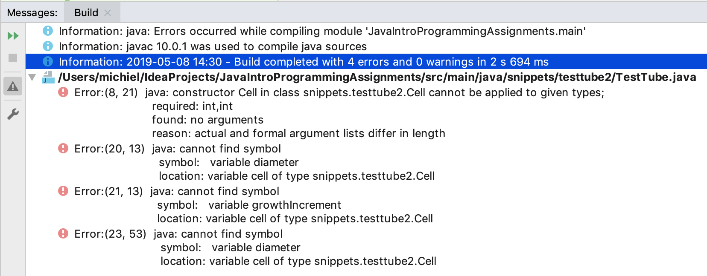

# Encapsulation through access modifiers

So far, we have not dealt with the concept of **_data hiding_** which actually is a pivotal aspect of object-oriented programming. This concept will be illustrated here, starting with the `Cell` class from **Part one** (see [A first look at objects](/01_getting_started/first_look_at_objects.md)). I modified it a bit for demonstration purposes. All access modifiers were removed and a check was introduced, so that the program crashes when a Cell grows too big.

```java
package snippets.testtube2;

public class Cell {
    //diameter in micrometers
    int diameter = 5;
    int growthIncrement = 1;

    /**
     * Lets this cell grow in a single increment
     */
    void grow() {
        //grow by 1 micrometer
        this.diameter += growthIncrement;
        //we can grow many cycles safely before resources run out
        if (this.diameter > 1000) throw new Error("TestTube will explode in 5 seconds");
    }
}
```

So, the logic of this cell is based on the assumption that it starts growing at size 5 with an increment of 1 at each cycle. Nothing funny going on.

Now here is a very simple version of class `TestTube`.

```java
package snippets.testtube2;

class TestTube {
    Cell cell;

    public static void main(String[] args) {
        TestTube tube = new TestTube();
        tube.cell = new Cell();
        //run for 5 generations
        for (int i = 0; i < 5; i++) {
            tube.growCells();
        }
    }

    /**
     * Grows the cells, in one single iteration.
     */
    void growCells() {
        //set diameter in nanometers
        cell.diameter = 6000;
        cell.growthIncrement = 750;
        cell.grow();
        System.out.println("cell diameter = " + cell.diameter);
    }
}
```

which outputs 

<pre class="console_out">
Exception in thread "main" java.lang.Error: TestTube will explode in 5 seconds
	at snippets.testtube2.Cell.grow(Cell.java:14)
	at snippets.testtube2.TestTube.growCells(TestTube.java:22)
	at snippets.testtube2.TestTube.main(TestTube.java:11)
</pre>

The TestTube developer was working with nanometer units while the Cell developer was working with micrometer units. The result is a crashing application (or Mars orbiter). 

Besides this big problem, when another class tries to run the `growCells()` method on a TestTube instance, it will get a `NullPointerException`. Can you figure out why?

**_So we need a way to protect the inner state of objects_**

Java has a heap of techniques for preventing illegal access or modification to your instance variables (and methods). These techniques start with the use of **_access modifiers_**.

Let's improve and secure this `Cell` and `TesTube` and keep access open only to that which needs to be publicly accessible.

Here is a new and improved Cell class:

```java
package snippets.testtube2;

public class Cell {
    private int diameterInMicrometers = 5;
    private final int growthIncrementInMicrometers;

    /**
     * Construct with diameter and growth increment, in micrometers.
     * 
     * @param diameterInMicrometers diameter between 1 and 40
     * @param growthIncrementInMicrometers growth increment between 1 and 5 
     */
    public Cell(int diameterInMicrometers, int growthIncrementInMicrometers) {
        if (diameterInMicrometers < 1
            || diameterInMicrometers > 41
            || growthIncrementInMicrometers < 1
            || growthIncrementInMicrometers > 6
        ) {
            throw new IllegalArgumentException("Cell size must start between 0 and 40 " +
                    "and growth increment between 0 and 5");
        }
        this.diameterInMicrometers = diameterInMicrometers;
        //growth increment can never be changed after construction
        this.growthIncrementInMicrometers = growthIncrementInMicrometers;
    }

    /**
     * Serves the read-only property diameter.
     * @return
     */
    public int getDiameterInMicrometers() {
        return diameterInMicrometers;
    }

    /**
     * Grows this cell in a single increment, increasing its size with one time
     * the growth increment.
     * 
     */
    public void grow() {
        this.diameterInMicrometers += growthIncrementInMicrometers;
        if (this.diameterInMicrometers > 1000) throw new Error("TestTube will explode in 5 seconds");
    }
}
```

Quite a lot has changed:
1. All instance variables have been marked `private` which means only code inside class Cell can access them. 
2. Variables have been renamed to be more precise.
3. A Constructor was added to provide a single point of access to both variables at construction time. 
4. The constructor performs a check on its parameters so that illegal arguments are caught early.
5. Javadoc was added to explain the public API.
6. A single **_getter_** was introduced for property diameter, making it a **_read-only property_**. 
7. No getter was created for property increment because it was decided by the developer (me) that it should only be set once during the life cycle of a Cell object. For that reason, property `growthIncrementInMicrometers` was **_marked final_**.


Therefore, `TestTube` will not compile because it attempts to access these `private` members of class Cell:



So the problem here is that TestTube tries to access properties of class Cell while they are private. Several solutions exist