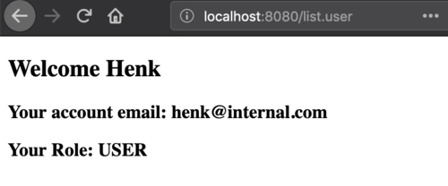

# Database interaction<br /> (and a bit of software design)

## Introduction
In this post, these topics will be discussed:
- Database interaction with Java applications: JDBC
- Java design issues that ensure flexible, reusable code that will easily deal with changing specs:
    - a different database provider
    - a different view
    - different analysis components
    - etc etc

Just remember: **_the only constant in programming is change_**.

&rArr; Have a look at the [repo](https://bitbucket.org/minoba/java_web_thymeleaf_demo) to see the full code of these examples.

## JDBC

Having Java applications talk with MySQL databases require that you have the required Driver in your project class path. Let's start with that. Put this line in te dependencies section of your `build.gradle` file:

```gradle
// https://mvnrepository.com/artifact/mysql/mysql-connector-java  
compile group: 'mysql', name: 'mysql-connector-java', version: '5.1.6'
```

You may need to refresh your Gradle project in the Gradle Tool window, if you did not check the auto refresh option when creating the project. 


### The database
Of course, you will need a MySQL server, a database and an account. Deal with that first before proceeding, if you don't have that!

Suppose we have a database called MyDB with this single, simple table `Users`:

| Field         | Type                           |
|---------------|--------------------------------|
| `user_id`       | `int AUTO-INCREMENT`                  |
| `user_name`     | `varchar(30)`                    |
| `user_password` | `varchar(30)`                    |
| `user_email`    | `varchar(30)`                    |
| `role`          | `enum('GUEST', 'USER', 'ADMIN')` |


### The model classes

These are the model classes that play a role in the database interaction.
Class `User`:

```java
package nl.bioinf.wis_on_thymeleaf.model;

import java.util.ArrayList;
import java.util.List;
import java.util.Objects;

public class User {
    private String name;
    private String email;
    private String password;
    private Role role;

    public User() {
    }

    public User(String name, String email, Role role) {
        this.name = name;
        this.email = email;
        this.role = role;
    }

    public User(String name, String email, String password, Role role) {
        this.name = name;
        this.email = email;
        this.password = password;
        this.role = role;
    }

    public void setPassword(String password) {
        this.password = password;
    }

    public void setRole(Role role) {
        this.role = role;
    }

    public String getName() {
        return name;
    }

    public String getEmail() {
        return email;
    }

    public String getPassword() {
        return password;
    }

    public Role getRole() {
        return role;
    }
    //toString(), equals(), hashCode() and getSome() omitted
}
```

The enum `Role`:

```java
package nl.bioinf.wis_on_thymeleaf.model;

public enum Role {
    GUEST,
    USER,
    ADMIN;
}
```

and my custom Exception type:

```java
package nl.bioinf.wis_on_thymeleaf.dao;

public class DatabaseException extends Exception {
    public DatabaseException() {
        super();
    }

    public DatabaseException(String message) {
        super(message);
    }

    public DatabaseException(String message, Throwable cause) {
        super(message, cause);
    }

    public DatabaseException(Throwable cause) {
        super(cause);
    }

    protected DatabaseException(String message, Throwable cause, boolean enableSuppression, boolean writableStackTrace) {
        super(message, cause, enableSuppression, writableStackTrace);
    }
}
```

### Database actions within IntelliJ

IntelliJ has excellent support for databases: it has an internal MySQL console, and supports autocomplete on in-code SQL statements and sql scripts.

To get this Database toolbox support active, you need let IntelliJ know about the database and follow these steps:

- View &rarr; Tool Windows &rarr; Database
- Click “+” &rarr; Data Source &rarr; MySQL


- Fill in the blanks


- Click "download missing driver files"
- Click "test connection"

Note the URL it creates. Check that the data provided corresponds with your situation.

- Open the console, 
- Enter a command 
- Press `Ctrl + enter`


### Add data to the DB

```mysql
DROP TABLE IF EXISTS Users;
CREATE TABLE Users (
    user_id INT NOT NULL auto_increment,
    user_name VARCHAR(100) NOT NULL,
    user_password VARCHAR(100) NOT NULL,
    user_email VARCHAR(255) NOT NULL,
    user_role VARCHAR(100) NOT NULL,
    primary key(user_id));
    
INSERT INTO Users (user_name, user_password, user_email, user_role)
VALUES ('Henk', 'Henkie', 'Henk@example.com', 'ADMIN');
```

Of course, **_storing a password unencrypted is a very bad idea_**. We will address this aspect later.

Next, have a look at the DB tool window:


## Code against interfaces, not implementations

What we could do next is create a class responsible for all database interaction (`MyMySqlDbConnector`), and use this class all over our code base. Something like this:

```java
MyMySqlDbConnector dbConnector = new MyMySqlDbConnector(url, user, pass);
```

Next year, after our application has grown, we decide a **_key-value store_** is better suited for our growing customer base. We create a new class, `MyCouchbaseConnector`. Unfortunately, everywhere we used the MySQL connector, we need to change our code to the new implementation.

```java
MyCouchbaseConnector dbConnector = new MyCouchbaseConnector();
```

And if we are unlucky, the `MyCouchbaseConnector` has differing method signatures as well, making the refactoring process a hellish job.

That is such an unnecessary waste of time if we would have adhered to one of the prime directives of OO programming: **Code against interfaces not implementations** (where interface may mean interface as type, but also abstract class).

The key to this principle is following this series of steps:

1. Think deeply about the contract: which methods do you need, disregarding the technology behind the scenes? This will be your interface definition.
Here is the interface specifying my user database interactions:

    ```java
    package nl.bioinf.wis_on_thymeleaf.dao;

    import nl.bioinf.wis_on_thymeleaf.model.Role;
    import nl.bioinf.wis_on_thymeleaf.model.User;

    public interface MyAppDao{

        /**
        * connection logic should be put here
        * @throws DatabaseException
        */
        void connect() throws DatabaseException;

        /**
        * shutdown logic should be put here
        * @throws DatabaseException
        */
        void disconnect() throws DatabaseException;
        /**
        * fetches a user by username and password.
        * @param userName
        * @param userPass
        * @return
        * @throws DatabaseException
        */
        User getUser(String userName, String userPass) throws DatabaseException;

        /**
        * inserts a new User.
        * @param userName
        * @param userPass
        * @param email
        * @param role
        * @throws DatabaseException
        */
        void insertUser(String userName, String userPass, String email, Role role) throws DatabaseException;
    }
    ```

2. Create a specific implementer:

    ```java
    class MyDbConnector implements MyAppDao { /*details will follow*/ }
    ```

3. Create a factory class that will create and serve the right type of implementer, preferably based on some external configuration setting (do you know where to put that?).

    ```java
    void someAppInitMethod() {
        MyDbConnector.createInstance("the_type");
    }
    ```

4. Use the interface type in all the rest of you code base:

    ```java 
    MyAppDao dao = MyDbConnector.getInstance();
    ```

## Create a MySQL implementer

### Step 1: JDBC class loading

This mechanism is called **_dynamic class loading_**:

```java
import java.sql.*;
class MyDbConnector implements MyAppDao {
    public void connect(){
        Class.forName("com.mysql.jdbc.Driver");
    }
}
```

### Step 2: create a Connection

After loading the driver class(es), you will need to establish a connection:

```java
@Override
public void connect() throws DatabaseException {
    try {
        Class.forName("com.mysql.jdbc.Driver");
        String dbUrl = "jdbc:mysql://MyHost/MyDbName";
        String dbUser = "Fred";
        String dbPass = "FredIsSafe";
        this.connection = DriverManager.getConnection(dbUrl, dbUser, dbPass);
    } catch (Exception e) {
            e.printStackTrace();
            throw new DatabaseException("Something is wrong with the database, see cause Exception",
                    e.getCause());
        }
    }
}
```

Note that hardcoding your passwords in a repo that you are going to put online is not such a good idea.  
Once you establish the connection, you have a live `java.sql.Connection` object. Talking to a database -an external resource- is risky business, so you have to put it in a try/catch block. In a real app, you should do something else with the exception than print it of course, but this post is not about exception handling. 

That's it. The connection is ready for reading and writing.

#### Use DButils to read your credentials

I have created a small helper app that you can use to prevent storing passowrds in your code. It reads your credentials from the `.my.cnf` file stored in your home folder.

You can clone and build the [repo](https://bitbucket.org/michiel_noback/dbutils)
or download the jar [here](../downloads/DButils-1.0.2.jar) and put it in your build path by adding the following line to the `build/gradle` file:

```gradle
compile files('path/to/library/folder/DButils-1.0.2.jar')
```

When you have it on the build path, simply use as follows:

```java
import nl.bioinf.noback.db_utils.DbCredentials;
import nl.bioinf.noback.db_utils.DbUser;
class DBCredDemo{
    void useCredentials() {
        DbUser dbUser = DbCredentials.getMySQLuser();
        String user = dbUser.getUserName();
        String passWrd = dbUser.getDatabasePassword();
        String host = dbUser.getHost();
        String dbName = dbUser.getDatabaseName();
    }
}
```

assuming your `my.cnf` file has the correct entries:

```conf
[client]
user=<db user name>
password=<db password>
host=localhost
database=<default database>
```

### Step 3: prepare the SQL statements

Using PreparedStatement instances makes it easier and far more efficient to repeat a query. Here are the two queries that are required for implementing the interface methods.

```java
    private static final String GET_USER = "get_user";
    private static final String INSERT_USER = "insert_user";

    /**
     * prepares prepared statements for reuse
     * @throws SQLException
     */
    private void prepareStatements() throws SQLException {
        String fetchQuery = "SELECT * FROM Users WHERE user_name = ? AND user_password = ?";
        PreparedStatement ps = connection.prepareStatement(fetchQuery);
        this.preparedStatements.put(GET_USER, ps);

        String insertQuery = "INSERT INTO Users (user_name, user_password, user_email, user_role) "
                        + " VALUES (?, ?, ?, ?)";
        ps = connection.prepareStatement(insertQuery);
        this.preparedStatements.put(INSERT_USER, ps);
    }
```

The prepared statements are stored as entries of a Map which is an instance variable of the class.
The `?` characters serve as placeholders, to be replaced with actual values before executing the statement. See next section.

### Step 4: Implement the interface methods

#### Inserting data

Now you are ready to put some data in the database

```java
    @Override
    public void insertUser(String userName, String userPass, String email, Role role) throws DatabaseException  {
        try{
            PreparedStatement ps = this.preparedStatements.get(INSERT_USER);
            ps.setString(1, userName);
            ps.setString(2, userPass);
            ps.setString(3, email);
            ps.setString(4, role.toString());
            ps.executeUpdate();
            ps.close();
        } catch (Exception ex) {
            ex.printStackTrace();
            throw new DatabaseException("Something is wrong with the database, see cause Exception",
                    ex.getCause());
        }
    }
```

#### Fetching data

Fetching data is not unlike inserting data. The difference is that you get results of course. Results can be traversed throught the `ResultSet` object that you get back from `ResultSet rs = ps.executeQuery();`.


```java
    @Override
    public User getUser(String userName, String userPass) throws DatabaseException  {
        try {
            PreparedStatement ps = this.preparedStatements.get(GET_USER);
            ps.setString(1, userName);
            ps.setString(2, userPass);
            ResultSet rs = ps.executeQuery();
            while (rs.next()) {
                String userMail = rs.getString("user_email");
                String userIdStr = rs.getString("user_id");
                String userRoleStr = rs.getString("user_role");
                Role role = Role.valueOf(userRoleStr);
                User user = new User(userName, userPass, userMail, role);
                return user;
            }
            rs.close();
        } catch (SQLException e) {
            e.printStackTrace();
            throw new DatabaseException("Something is wrong with the database, see cause Exception",
                    e.getCause());

        }
        return null;
    }
```

Here, you see the use of `while (rs.next()) {}` which is not entirely logical if you expect a single result, as in this case. Maybe it is better to add some checks, such as:

```java
if (rs.getFetchSize() > 1) {
    throw new DatabaseException("something wrong");
}
```

### Step 5: cleanup code

After you are done, you must **carefully** clean up your database resources.

Here is my `disconnect()` implementation:

```java
    @Override
    public void disconnect() throws DatabaseException {
        try{
            for( String key : this.preparedStatements.keySet() ){
                this.preparedStatements.get(key).close();
            }
        }catch( Exception e ){
            e.printStackTrace();
        }
        finally{
            try {
                connection.close();
            } catch (SQLException e) {
                e.printStackTrace();
            }
        }
    }
```

So, which objects need to be close explicitly:
- `ResultSet` (here: done in method itself)
- `PreparedStatemenent`
- `Connection` (always last)

### Clean up the code and implement Singleton

Now we know it works, it is time to move the use of `DbCredentials` somewhere else, out of the `MyAppDaoMySQL` class. Reason: it is not according to the SRP. In this implementation, it is moved to the `MyAppDaoFactory` class (see below). 

Also, I want class `DbCredentials` to be instantiated only once - we do not want to create resource-heavy classes twice if we can prevent it. To guarantee this, the **_singleton pattern_** is implemented.  It has three components:

- a private static instance
- a private constructor (only this class can instantiate itself)
- a public static method serving the single instance

```java
    private static MyAppDaoMySQL uniqueInstance;

    private MyAppDaoMySQL(String url, String dbUser, String dbPassword) {
        this.url = url;
        this.dbUser = dbUser;
        this.dbPassword = dbPassword;
    }

    public static MyAppDaoMySQL getInstance(String url, String dbUser, String dbPassword) {
        //lazy instantiation
        if (uniqueInstance == null) {
            uniqueInstance = new MyAppDaoMySQL(url, dbUser, dbPassword);
        }
        return uniqueInstance;
    }
```

Key here is the private constructor which guarantees ony code within class `MyAppDaoMySQL` can instantiate its objects, and it does so only once.
This solution is simple, but **not thread safe!**. In a later course, we'll revisit this.

## Create a factory class

Now we have an implementer of the interface, it is time to make the API available to the application. We do this via a **_factory class_**, which is a class whose task it is to create and serve objects implementing a specific interface, based on some parameter.

This is the factory class:

```java
package nl.bioinf.wis_on_thymeleaf.dao;

import nl.bioinf.noback.db_utils.DbCredentials;
import nl.bioinf.noback.db_utils.DbUser;

import java.io.IOException;

public class MyAppDaoFactory {
    private static MyAppDao daoInstance;

    /**
     * Code should be called at application startup
     */
    public static void initializeDataSource(String type) throws DatabaseException {
        if (daoInstance != null) {
            throw new IllegalStateException("DAO can be initialized only once");
        }
        switch(type) {
            case "dummy": {
                createDummyInstance();
                break;
            }
            case "mysql": {
                createMySQLInstance();
                break;
            }
            default: throw new IllegalArgumentException("unknown database type requested");
        }
    }

    /**
     * serves the dao instance
     * @return
     */
    public static MyAppDao getDataSource() {
        if (daoInstance == null) {
            throw new IllegalStateException("DAO is not initialized; call initializeDataSource() first");
        }
        return daoInstance;
    }

    private static void createDummyInstance() throws DatabaseException {
        daoInstance = new MyAppDaoInMemory();
        daoInstance.connect();
    }

    private static void createMySQLInstance() throws DatabaseException {
        try {
            DbUser mySQLuser = DbCredentials.getMySQLuser();
            String dbUrl = "jdbc:mysql://" + mySQLuser.getHost() + "/" + mySQLuser.getDatabaseName();
            String dbUser = mySQLuser.getUserName();
            String dbPass = mySQLuser.getDatabasePassword();
            daoInstance = MyAppDaoMySQL.getInstance(dbUrl, dbUser, dbPass);
            daoInstance.connect();
        } catch (IOException | NoSuchFieldException e) {
            throw new DatabaseException(e);
        }
    }
}
```

When the MySQL type is requested for initialization, the url, name and password need to be provided. It is read from the `.my.cnf` file as shown before.

## Get hold of the dao implementation, whatever that may be

The `web.xml` deployment descriptor is an excellent place to specify which implementation of the `MyAppDao` interface to use:

```xml
    <context-param>
        <param-name>db_type</param-name>
        <param-value>mysql</param-value>
    </context-param>
```

Finally, the datasource need to be initialized at application startup, requested from the class `MyAppDaoFactory`. 
You have seen the application startup hook in a previous post (see [servlet details and lifecycle hooks](servlet_details.md)); 
it was implemented in class `WebConfig`.
Here, the DAO initialization is done within that method, `contextInitialized()`.

```java
@WebListener
public class WebConfig implements ServletContextListener {

    @Override
    public void contextInitialized(ServletContextEvent servletContextEvent) {
        //other code

        //fetch the database type
        String dbType = servletContextEvent.getServletContext().getInitParameter("db-type");
        try {
            MyAppDaoFactory.initializeDataSource(dbType);
        } catch (DatabaseException e) {
            e.printStackTrace();
            //this should be logged of course; and dealt with elegantly
        }
    }
    //other code
}
```

Finally, test!

Here is the relevant servlet code:

```java
    protected void doGet(HttpServletRequest request, HttpServletResponse response) throws ServletException, IOException {
        final MyAppDao dataSource = MyAppDaoFactory.getDataSource();
        try {
            final User user = dataSource.getUser("Henk", "Henkie");
            final TemplateEngine templateEngine = WebConfig.getTemplateEngine();
            WebContext ctx = new WebContext(request, response, request.getServletContext(), request.getLocale());
            ctx.setVariable("user", user);
            templateEngine.process("user-details", ctx, response.getWriter());
        } catch (DatabaseException e) {
            e.printStackTrace();
        }
```

and the thymeleaf view:

```html
<!DOCTYPE html SYSTEM "http://www.thymeleaf.org/dtd/xhtml1-strict-thymeleaf-4.dtd">
<html xmlns="http://www.w3.org/1999/xhtml" xmlns:th="http://www.thymeleaf.org">
<head>
    <title>Show user</title>
    <meta http-equiv="Content-Type" content="text/html; charset=UTF-8" />
    <script src="js/myPage.js" type="application/javascript"></script>
</head>
<body>
<!-- welcome message read from resource bundle welcome.html-->
<h2 th:text="'Welcome ' + ${user.name}"></h2>
<h3 th:text="'Your account email: ' + ${user.email}"></h3>
<h3 th:text="'Your Role: ' + ${user.role.name}"></h3>
</body>
</html>
```

**db-type=mysql**


**db-type=dummy**



This constitutes the final layer in the app: the data layer:


